===============
Getting Started
===============

This tutorial provides an overview on how to use the CALIPSO Visualization 
Tool program.

----------------
Interface Layout
----------------

Upon first starting VOCAL, you will be greeted with the initial view of the application. The large center most
window is the main screen for displaying data from ``.HDF`` files, this will be where you **see** the data.

.. image:: _static/startup.png
   :scale: 40%

The top most menu bar contains three directories: ``file`` , ``polygon`` and ``help``. These are self explanatory,

* ``file`` allows a user to import an HDF (same as |browse|), save all objects from all plots to a JSON file, save
  only *visible* objects on the screen to a JSON file, or exit the application.
* ``polygon`` relates to the database use, see :ref:`database` for more information.
* ``help`` shows information on the project, and links to this website

Located near the menu and off to the top right you'll find |sele| , this drop down menu is populated with all shapes
currently drawn to the plot and will highlight the selected shape. If you wish to unselect all shapes, selecting the
blank field will do so

Off to the right is the tools window, this window is dedicated to the manipulation of the data displayed to the plot.

* |rese| destroy all shapes existing in the plot and reset the view back to the original view of the initial
  render
* |back| Selection option used when visualizing, having this option checked will display the data
  as backscattered
* |depo| Selection option used when visualizing, having this option checked will display the data as
  depolarized.
* |step| Specify the range of time to plot to, from ``x`` to ``y``. Default is ``x`` + 1000 if no ``y``, and
  0 - 1000 if neither ``x`` nor ``y``
* |fren| Visualize the data given the conditions entered into **step** and **backscattered/depolarized**
       
-----------
Starting Up
-----------

To load a CALIPSO hdf file from the local file directory, click the |browse| button at the
top of the screen. Navigate to the .HDF file of your choice and select **open** The file text box will now update and
display the name of the imported hdf file. The main screen will appear blank at first. To display a plot,
Select the type of plot you would like with either |back| or |depo| to render and an optional step
|step| (*the default is from 0 to 1000*).
Hit |rend| to visualize the data to the screen.
 
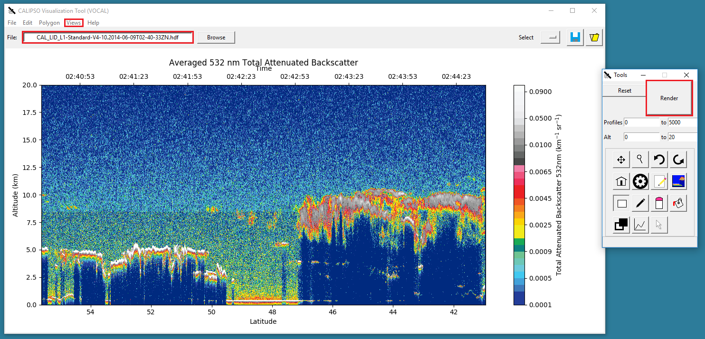
 	   
-------------------
Navigating the Plot
-------------------

The first row of toolbar buttons allows you to manipulate the plot for the purpose of drawing.

* |move| Pan: Clicking and dragging will allow you to move the plot across
  the screen by the amount of drag used, either left or right.
* |magn| Magnify: Selecting this
  button will allow you to zoom in and out of the plot. To zoom in, click and
  drag with the left mouse button the area on the plot you wish to zoom in. To
  zoom out, click and drag with the right mouse button and the plot will zoom
  out based upon the scale difference of the area you highlighted.
* |undo| Undo: jump to the previous magnification zoom frame
* |redo| Redo: jump forward to the next magnification zoom frame
* |home| Home: reset the view to the original render

----------------------------
Viewing Properties of Shapes
----------------------------

The second row of buttons (minus the home button) is dedicated to the viewing, assigning, and
extraction of data from shapes

* |prop| Properties: Clicking on a shape while the properties button is active will open a small
  window detailing the range of time and altitude covered by the shape, attributes, and notes.
  click once more to hide the properties window
* |attr| Attributes: Clicking on a shape while the attributes button is active will open a
  dialog window for assigning attributes to shapes. Attributes on the **left** are the *available*
  attributes, the **right** side is the *selected* attributes. Add any notes you wish and click
  ``save`` to save the notes and attributes. These can be viewed with |prop|
* |extr| Extract: Clicking on a shape while the extract button is active will create a subplot
  containing only the data enclosed in the shape. Future features are to come but for now a
  subplot and histogram are generated for the shape.

--------------
Drawing Shapes
--------------

The third row of buttons is for creating and manipulating the physical properties of
shapes drawn to the plot.

* |rect| Rectangle: Dragging the cursor in the plot will create an outline of a rectangle,
  upon release of the cursor the shape will be created in place of the outline.
* |fred| Free Draw: Clicking on the plot will create a *vertex*, multiple clicks will
  bind vertices together and create lines. If a new line is found interesting an
  existing line a shape will be formed at the intersection being the enclosing vertex.
* |eras| Erase: Selecting this button and clicking a shape will remove it from the plot. *note: *
  this will **not** delete the object in a database or JSON file if it is loaded, that is a
  separate deletion itself
* |pain| Paint: Give a shape a new color value by selecting either a predefined color or
  some custom value on the color wheel. Changing the color of a shape will not create
  a new shape, simply update the color value of existing shapes you've loaded.

----------------------------------
Hiding and Sharing Specific Shapes
----------------------------------

The last row of buttons deals with global state of shape viewing as well as the exporting
of shapes to a JSON file.

* |focs| Focus: Press this button to display all shapes *and* future shapes as unfilled.
  Only the outline of the shapes will be drawn, pressing this one more reverts the change
* |hide| Hide: Similar to Focus, but pressing this button will **completely** hide all shapes,
  they still exist; however they simply won't be drawn to the screen.
* |save| Save: Save all existing objects in the **current** plot to a ``JSON`` formatted file.
  These objects can be loaded back into the screen with |load| and can be shared
  between researchers that wish to personally hand over shapes to another user for loading. If
  you wish to save all shapes from **every** plot into one fill, these is a ``save all`` option
  in the file menu for this.
* |load| Load: Given a valid ``.JSON`` file, load all polygon objects present in the file and
  display them to the plot.

.. _database:

------------------
Using the Database
------------------

One of the defining features of VOCAL is the ability to import and export shapes to a database, this can
help researchers share information about aerosols and their trajectory. The database can be accessed under
the ``polygon`` menu, offering to either *import from database* or *export to database* . Let's start with exporting.

Exporting Shapes
################

Say you have a number of shapes you've labeled with attributes and want to share with other researchers

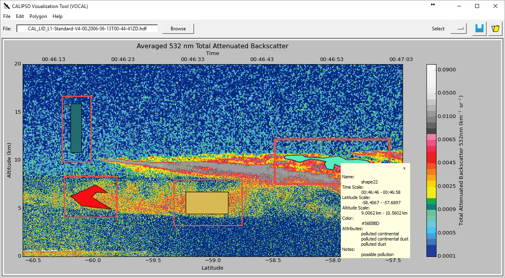

Exporting these shapes is as easy as going to the ``polygon`` menu and hitting *export to database*

|expo|

All objects have now been exported to the database! All done!

Importing Shapes
################

Now lets import some shapes, consider down the road
your database now has a number of different objects from different files; your coworker tells you "Hey, check out
shape 31 by John and it's properties". There are a couple ways to go about this, first head over to the
*import from database* window.

|impo|

This will open the import dialog

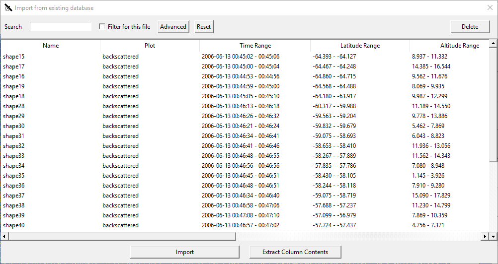

|dbse| allows the user to dynamically query the database for keys entered into the search bar. It will currently
search the ``Name``, ``Attributes``, and ``Notes`` notes categories for the string entered. |dbfi| will filter
all entries based on whether the filename matches the current filename loaded, *note:* this will **not** work
if your HDF has been renamed in anyway from the standard CALIPSO naming conventions. |dbde| will delete any
selected entries from the database, and this is **permanent**, there's no undo button here.

So you can go ahead and search either the query *John* to get all notes that include the name john, or
*shape31* to get the specific shape. All names are **unique**, if at any time you see two shapes with the
same tag this is a bug on our part please report that issue immediately to us for fixing. So searching for *shape31*
will leave you with

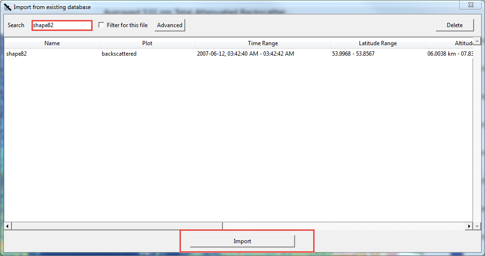

Clicking |dbim| will now import the selection to your internal shape manager. If you aren't on the correct file the
shape was drawn one you won't be able to see it, each file has a unique range of time thus on object can be loaded
onto multiple files. Scrolling right on the import window would have revealed the column File Name, which read
``CAL_LID_L1-ValStage1-V3-01.2007-06-12T03-42-18ZN``, so upon loading up that file walla! your object should appear.

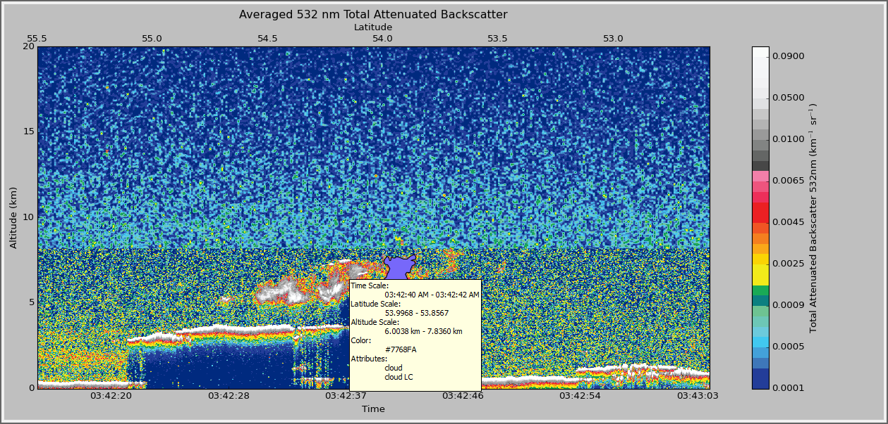

you're free to view properties of this shape, export it's data to JSON or even modify the shape and re-export it
back to the database.

---------------------
Sharing Your Database
---------------------

Now say you get into contact with another researcher, one who's been developing a database on tracking low
hanging clouds in the atmosphere for example; you've been focusing on tracking other objects but
would love to take a look at his shapes, well VOCAL has a feature for sharing entire databases with each
other!

Exporting To an Archive
#######################

Let's export a database first, you'll find the database exportation feature in the **Polygon** menu option,
pictured here:

|exar|

Selecting this option will ask you if you wish to really export your database to an achive, and selecting
yes will prompt you with a file dialog for choosing the name and location of the archive you'd like to
create.

.. note::

   Exporting your database is a *copy* operation, the contents of your database will remain the same and
   simply be copied to the archive, which can be loaded as shown below

Once exported you'll have an archive of your specified name, something like ``my_shapes.zip``. Feel free
to take a peek inside the file, it's simply a formatted zip containing your shapes exported in a JSON
format. Now you can share this archive file to whoever you wish and easily share your entire database
for other researchers!

Importing From an Archive
#########################

Now when you receive a database archive yourself, you'll want to import that archive and start using the
shapes right away; the command ``Import archive to database`` will do just that.

|imar|

Upon clicking this menu option, a prompt will open asking you for a valid *.zip* file. Navigate to a zip
file in the valid format that ``Export database to archive`` produced, and open that. VOCAL will
then extract the data from that file and import all objects located in the archive.

.. warning::

   Importing shapes from an archive will **not** preserve their tag, regardless of whether is already
   exists or not, imported shapes are treated as 'new' creations e.g. they will be assigned a unique tag
   based off of the current database tags.

.. |browse| image:: _static/browse_button.png
.. |move| image:: _static/move_button.png
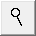
.. |undo| image:: _static/undo_button.png

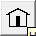
.. |prop| image:: _static/properties_button.png
.. |attr| image:: _static/attributes_button.png
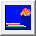
.. |rect| image:: _static/rect_button.png

.. |eras| image:: _static/erase_button.png
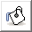

.. |hide| image:: _static/hide_button.png

.. |load| image:: _static/load_button.png

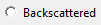
.. |depo| image:: _static/depolarized_button.png
.. |rend| image:: _static/render_button.png
   :scale: 50%
.. |fren| image:: _static/render_button.png
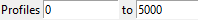

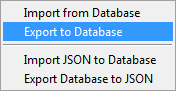
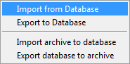
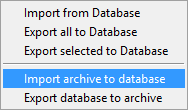
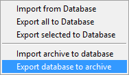
.. |sele| image:: _static/select_menu.png

.. |dbse| image:: _static/db_search.png
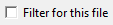
.. |dbde| image:: _static/db_delete.png
.. |dbim| image:: _static/db_import.png
