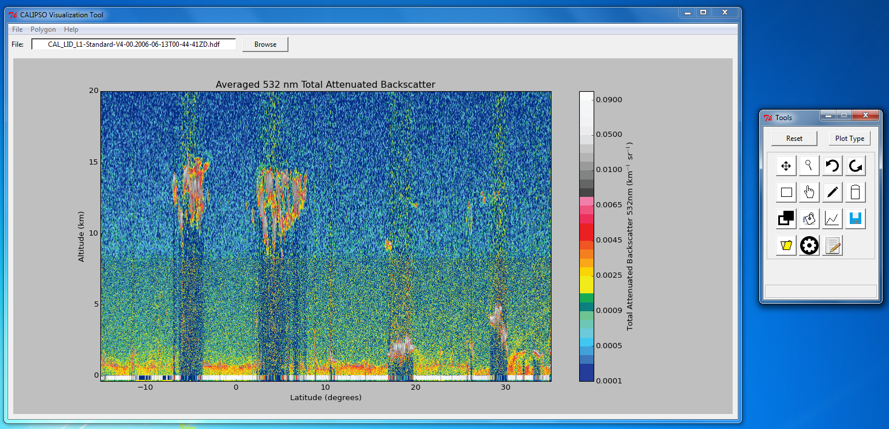

=====================
Tutorial
=====================

This tutorial provides an overview on how to use the CALIPSO Visualization 
Tool program.

----------------------------------------
Main Screen
----------------------------------------

The CALIPSO Visualization Tool window is the main screen for displaying 
CALIPSO data and shapes. The menu bar provides access to the shape database 
and loading CAlIPSO hdf files. The Visualization Tool window is accompanied by
a toolwindow that contains buttons for manipulating the main screen, drawing 
shapes, and saving and loading shapes. 
 
.. image:: _static/startup.png
   :scale: 40%
       
----------------------------------------
Starting Up
----------------------------------------

To load a CALIPSO hdf file from the local file directory, click the "Browse" 
button and select the desired hdf file. The file text box will now update and 
display the name of the imported hdf file. The main screen will appear blank 
at first. To display a plot, click the "Plot Type" button in the toolwindow. 
A drop down menu will appear with the available plots. Clicking on a selection
will dipslay the plot on the main screen. 
 

 	   
----------------------------------------
Plot Navigation
----------------------------------------

The first row of buttons provide plot navigation. The four pointed arrows are 
the pan button. Pressing this button will allow you to move the plot across 
the screen by clicking and dragging the plot with the left mouse button. The 
next button with the magnifying glass icon is the zoom button. Selecting this 
button will allow you to zoom in and out of the plot. To zoom in, click and 
drag with the left mouse button the area on the plot you wish to zoom in. To 
zoom out, click and drag with the right mouse button and the plot will zoom 
out based upon the scale difference of the area you highlighted. The next two 
buttons are the undo and redo buttons, respectively. Clicking the undo button 
will undo the most recent pan or zoom action. The redo button will redo any 
pan or zoom action. Lastly, the "Reset" button will rest all plot navigation 
actions and return the plot window back to its initial state.

----------------------------------------
Shape Drawing
----------------------------------------

The next seven buttons are used for shape drawing. The rectangle icon 
represents rectangle drawing. Pressing this button will allow you to draw 
rectangles. After pressing the button, click and drag with the left mouse 
button to draw a rectangle. The hand icon is the shape dragging button. When 
this button is selected, you can drag shapes by clicking and dragging with the
left mouse button. The pencil icon represents the free draw action. With this
action, you can draw polygon shapes. To draw a shape, click with the left 
mouse button to plot a point. Click again on a different spot to draw another 
point. After you plot the third point, if a line intersects with any 
previously drawn line, the plot will draw a shape based on the point of 
intersection. The last button in the row is the erase button, which allows 
you to delete shapes drawn on the plot. To delete a shape, simply click with 
the left mouse button the desired shape to be deleted.

In the third row, the button with overlapping rectangles is the toggle outline
button. When this button is pressed, all shapes drawn on the plot will only 
display their outlines. Pressing the button again will fill the shapes with 
solid colors. The next button is the paint button. To recolor a drawn shape, 
click with the left mouse button the desired shape. A dialog will prompt you 
to select which color to repaint the shape. The third button in the row is the
hide shapes button. Pressing this button will hide all shapes drawn on the 
plot. Clicking on the button again will make the shapes visible again.

----------------------------------------
Shape Saving and Loading
----------------------------------------

To save shapes draw on the plot, click on the button with the floppy disk 
image (third row, fourth button). If the shapes haven't been saved previously,
a file dialog will prompt you to save the shapes on your local file directory.
The shapes are saved as JavaScript Object Notation (JSON) files with the .json
file extension. If the shapes have been already saved, saving the shapes again
will automatically update the JSON file. To load the file, select the file 
with the folder icon (fourth row, first button). A file dialog will prompt you
to select one JSON file to import in your local file directory. 